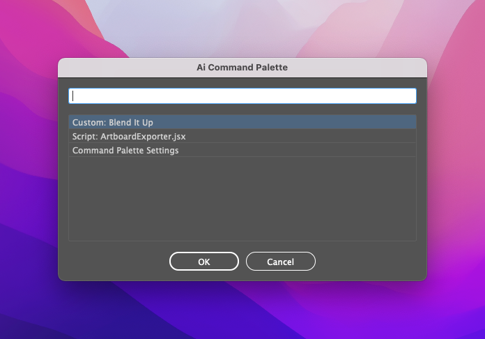

# Ai Command Palette

If you have worked with Alfred app or VS Code you know how great the “command palette” is… Well, I wanted that same functionality in Adobe Illustrator so here's what I've come up with.

## You can execute:
- most any Illustrator Menu command
- any actions from your Actions Palette
- scripts from anywhere on your filesystem

**AND you can build custom commands that chain other commands together!** 🤯

## Video Demo

    <iframe width="560" height="315" src="https://www.youtube.com/embed/Jhh_Dvfs0ro" title="YouTube video player" frameborder="0" allow="accelerometer; autoplay; clipboard-write; encrypted-media; gyroscope; picture-in-picture" allowfullscreen></iframe>

I recommend installing this action into your scripts folder, then tying it to a keyboard shortcut using something like [Keyboard Maestro](https://www.keyboardmaestro.com/main/) (Mac), [BetterTouchTool](https://folivora.ai/) (Mac), or [AutoHotkey](https://www.autohotkey.com/) (Windows).

ℹ️ I like to use the keyboard shortcut Command-Shift-P since it is somewhat mnemonic for "palette".

⚠️ **PLEASE NOTE:** Using this command palette requires some basic knowledge of Illustrator. The script doesn't know which commands can or can't be ran at time of execution so tread carefully. Most every action this script executes can be undone by choosing Edit > Undo (from the Edit menu at the top of your screen), or by pressing Command-Z (Mac) or Control+Z (Windows).

⚠️ **MENU COMMANDS:** I am aware that not all of the included built-in menu commands work. There are a little of 500 included in this script so I'm not interested in testing them all. If you find one that doesn't work, please file an issue in this repository ([learn how here](https://docs.github.com/en/issues/tracking-your-work-with-issues/creating-an-issue)).

❓ Need help installing this script? Checkout this great guide from [Mars Premedia](https://www.marspremedia.com/software/how-to-adobe-cc#illustrator).

## Credits
- [Shalako Lee](https://github.com/shalakolee) for the list of built-in menu commands and their respective `executeMenuCommand()` commands.
- [sttk3](https://community.adobe.com/t5/illustrator-discussions/get-names-of-actions-in-some-set/td-p/10365284) for the awesome bit of code that get all of the currently installed Action Sets and Actions.
- Peter Kahrel and his amazing [ScriptUI for Dummies](https://adobeindd.com/view/publications/a0207571-ff5b-4bbf-a540-07079bd21d75/92ra/publication-web-resources/pdf/scriptui-2-16-j.pdf) book.
- [Sergey Osokin](https://github.com/creold) for the clever `openURL()` function.
